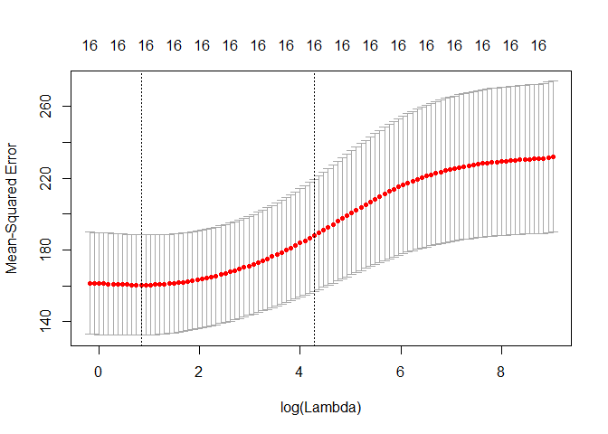
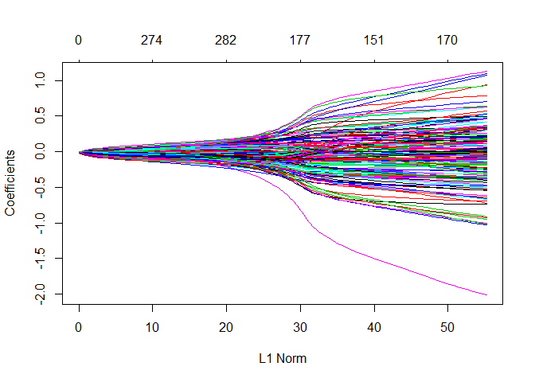

QUESTION 1. library needed

``` r
library(ISLR)
```

    ## Warning: package 'ISLR' was built under R version 3.6.2

``` r
#the dataset is in the library above
College2 = data.frame(PctAccept=100*(College$Accept/College$Apps),College[,-c(2:3)])
str(College2)
```

    ## 'data.frame':    777 obs. of  17 variables:
    ##  $ PctAccept  : num  74.2 88 76.8 83.7 75.6 ...
    ##  $ Private    : Factor w/ 2 levels "No","Yes": 2 2 2 2 2 2 2 2 2 2 ...
    ##  $ Enroll     : num  721 512 336 137 55 158 103 489 227 172 ...
    ##  $ Top10perc  : num  23 16 22 60 16 38 17 37 30 21 ...
    ##  $ Top25perc  : num  52 29 50 89 44 62 45 68 63 44 ...
    ##  $ F.Undergrad: num  2885 2683 1036 510 249 ...
    ##  $ P.Undergrad: num  537 1227 99 63 869 ...
    ##  $ Outstate   : num  7440 12280 11250 12960 7560 ...
    ##  $ Room.Board : num  3300 6450 3750 5450 4120 ...
    ##  $ Books      : num  450 750 400 450 800 500 500 450 300 660 ...
    ##  $ Personal   : num  2200 1500 1165 875 1500 ...
    ##  $ PhD        : num  70 29 53 92 76 67 90 89 79 40 ...
    ##  $ Terminal   : num  78 30 66 97 72 73 93 100 84 41 ...
    ##  $ S.F.Ratio  : num  18.1 12.2 12.9 7.7 11.9 9.4 11.5 13.7 11.3 11.5 ...
    ##  $ perc.alumni: num  12 16 30 37 2 11 26 37 23 15 ...
    ##  $ Expend     : num  7041 10527 8735 19016 10922 ...
    ##  $ Grad.Rate  : num  60 56 54 59 15 55 63 73 80 52 ...

You will be using the data frame College2 for parts (a) – (h) of this
problem with PctAccept as the response.

1.  Split the data into a training set and a test set by forming the
    indices for the training and test sets. Use p = .6667, i.e. use
    two-thirds of the data to train the models.

``` r
set.seed(1)
sam = sample(1:777,size=floor(.6667*777),replace=F) # spliting it into training and test set
View(sam)
```

College2\[sam , \] = training set College2\[-sam,\] = validation set b)
Fit an OLS model for number of applications using the training set, and
report the mean RMSEP for the test set

``` r
X = model.matrix(PctAccept~.,data=College2[sam, ]) [,-1]
y = College2[sam, ]$PctAccept
Xs = scale(X)
College2.temp = data.frame(y, Xs)
sam = sample(1:length(y),floor(.6667*length(y)),replace=F)
```

``` r
PA.ols = lm(y~Xs,data=College2.temp, subset = sam)
summary(PA.ols)
```

    ## 
    ## Call:
    ## lm(formula = y ~ Xs, data = College2.temp, subset = sam)
    ## 
    ## Residuals:
    ##     Min      1Q  Median      3Q     Max 
    ## -56.918  -8.167   1.238   8.273  33.780 
    ## 
    ## Coefficients:
    ##               Estimate Std. Error t value Pr(>|t|)    
    ## (Intercept)    74.1309     0.6979 106.227  < 2e-16 ***
    ## XsPrivateYes    3.4931     1.1250   3.105 0.002069 ** 
    ## XsEnroll        2.5232     2.7659   0.912 0.362305    
    ## XsTop10perc    -6.4621     1.8859  -3.427 0.000689 ***
    ## XsTop25perc     0.4403     1.5540   0.283 0.777105    
    ## XsF.Undergrad  -0.3755     2.9751  -0.126 0.899638    
    ## XsP.Undergrad  -2.3789     1.1659  -2.040 0.042115 *  
    ## XsOutstate      2.3058     1.4253   1.618 0.106665    
    ## XsRoom.Board   -2.4043     1.0001  -2.404 0.016763 *  
    ## XsBooks        -2.3260     0.7605  -3.059 0.002407 ** 
    ## XsPersonal      1.1698     0.7367   1.588 0.113254    
    ## XsPhD           1.1573     1.5628   0.741 0.459488    
    ## XsTerminal     -0.6715     1.4127  -0.475 0.634882    
    ## XsS.F.Ratio    -0.9292     0.9483  -0.980 0.327914    
    ## Xsperc.alumni   0.7769     0.9404   0.826 0.409313    
    ## XsExpend       -2.8349     1.2066  -2.349 0.019392 *  
    ## XsGrad.Rate    -2.4723     0.9629  -2.568 0.010681 *  
    ## ---
    ## Signif. codes:  0 '***' 0.001 '**' 0.01 '*' 0.05 '.' 0.1 ' ' 1
    ## 
    ## Residual standard error: 12.85 on 328 degrees of freedom
    ## Multiple R-squared:  0.3204, Adjusted R-squared:  0.2873 
    ## F-statistic: 9.667 on 16 and 328 DF,  p-value: < 2.2e-16

``` r
ypred = predict(PA.ols, newdata = College2.temp[-sam])
RMSEP.ols = sqrt(mean((y[-sam]-ypred)^2))
```

    ## Warning in y[-sam] - ypred: longer object length is not a multiple of
    ## shorter object length

``` r
RMSEP.ols
```

    ## [1] 17.77017

1.  Fit a sequence of ridge and lasso regression models on the training
    The lambda sequence (grid) is formed to create the sequence of
    models. Create two plots showing the parameter shrinkage, one with
    the norm constraint on the x-axis and one with log lambda values on
    the x-axis

``` r
library(glmnet)
```

    ## Loading required package: Matrix

    ## Loading required package: foreach

    ## Loaded glmnet 2.0-18

``` r
grid = 10^seq(10, -2, length= 200)
#grid
```

RIDGE MODEL

``` r
ridge.mod = glmnet(Xs,y,alpha=0,lambda=grid)
summary(ridge.mod)
```

    ##           Length Class     Mode   
    ## a0         200   -none-    numeric
    ## beta      3200   dgCMatrix S4     
    ## df         200   -none-    numeric
    ## dim          2   -none-    numeric
    ## lambda     200   -none-    numeric
    ## dev.ratio  200   -none-    numeric
    ## nulldev      1   -none-    numeric
    ## npasses      1   -none-    numeric
    ## jerr         1   -none-    numeric
    ## offset       1   -none-    logical
    ## call         5   -none-    call   
    ## nobs         1   -none-    numeric

``` r
plot(ridge.mod) 
```


RIDGE (x log)

``` r
plot(ridge.mod,xvar= "lambda")
```


RIDGE MODEL SUMMARY: When looking at the coefficients, the first graph
has normal constraint and there is not good shrinkage. The second plot
shows shrinkage going to 0 when lambda is in log for and there is better
shrinkage from log lambda 7 – 25. That’s where I would expect my best
lambda to be at.

LASSO MODEL

``` r
lasso.mod = glmnet(Xs,y,alpha=1,lambda=grid)
summary(lasso.mod)
```

    ##           Length Class     Mode   
    ## a0         200   -none-    numeric
    ## beta      3200   dgCMatrix S4     
    ## df         200   -none-    numeric
    ## dim          2   -none-    numeric
    ## lambda     200   -none-    numeric
    ## dev.ratio  200   -none-    numeric
    ## nulldev      1   -none-    numeric
    ## npasses      1   -none-    numeric
    ## jerr         1   -none-    numeric
    ## offset       1   -none-    logical
    ## call         5   -none-    call   
    ## nobs         1   -none-    numeric

``` r
plot(lasso.mod)
```

    ## Warning in regularize.values(x, y, ties, missing(ties)): collapsing to
    ## unique 'x' values


LASSO (X log)

``` r
plot(lasso.mod, xvar= "lambda")
```


LASSO SUMMARY: With an alpha of 1, Lasso model doesn’t do a good
shrinkage job when its in the normal constraint but performs better when
its in log lambda form. I would expect the best lambda to be between log
lambda 2 – 25 because all the coefficients have been shrunk to 0 at log
lambda 2.

1.  Use cross-validation to determine the “optimal” values for the
    shrinkage parameter for both ridge and lasso and plot the
    results for ridge

``` r
cv.out = cv.glmnet(X,y,alpha=0)
plot(cv.out)
```


``` r
bestlam = cv.out$lambda.min
bestlam
```

    ## [1] 1.167237

using the best lamba 0.733 for ridge for lasso

``` r
cv.out = cv.glmnet(X,y,alpha=1)
plot(cv.out)
```


``` r
bestlam2 = cv.out$lambda.min
bestlam2
```

    ## [1] 0.04004169

using the best lamba for lasso methodes

1.  Using the optimal lambda (bestlam) for both ridge and Lasso
    regression fit both models and compare the estimated coefficients
    for the OLS, ridge, and Lasso regressions. Discuss. ridge

``` r
bestlam = cv.out$lambda.min
ridge.best = glmnet(X[sam, ], y[sam], alpha = 0, lambda = bestlam)
ridge.pred = predict(ridge.best, newx = X[-sam, ])
rmse = sqrt(mean((ridge.pred- y[-sam])^2))
rmse
```

    ## [1] 11.55667

for lasso

``` r
bestlam2 = cv.out$lambda.min
lasso.best = glmnet(X[sam, ], y[sam], alpha = 1, lambda = bestlam2)
lasso.pred = predict(lasso.best, newx = X[-sam, ])
rmse = sqrt(mean((lasso.pred- y[-sam])^2))
rmse 
```

    ## [1] 11.5499

for all of them

``` r
cbind(coef(ridge.best), coef(lasso.best), coef(PA.ols))
```

    ## 17 x 3 sparse Matrix of class "dgCMatrix"
    ##                        s0            s0           
    ## (Intercept)  1.013616e+02  1.010175e+02 74.1309253
    ## PrivateYes   7.900618e+00  7.853030e+00  3.4931412
    ## Enroll       2.755674e-03  2.375156e-03  2.5231697
    ## Top10perc   -3.589003e-01 -3.390920e-01 -6.4621161
    ## Top25perc    1.858638e-02  4.910256e-03  0.4402789
    ## F.Undergrad -5.309769e-05  .            -0.3755109
    ## P.Undergrad -1.454065e-03 -1.416943e-03 -2.3789053
    ## Outstate     5.449323e-04  5.075860e-04  2.3058280
    ## Room.Board  -2.149686e-03 -2.091549e-03 -2.4043244
    ## Books       -1.582988e-02 -1.560808e-02 -2.3260060
    ## Personal     1.683041e-03  1.612205e-03  1.1698365
    ## PhD          7.068092e-02  5.079898e-02  1.1573260
    ## Terminal    -4.522949e-02 -2.555721e-02 -0.6714662
    ## S.F.Ratio   -2.341535e-01 -2.169609e-01 -0.9291726
    ## perc.alumni  6.290398e-02  6.018588e-02  0.7769344
    ## Expend      -4.993107e-04 -4.860572e-04 -2.8349080
    ## Grad.Rate   -1.408538e-01 -1.356967e-01 -2.4722906

SUMMARY: As you can see, the variables in the OLS model are higher than
the Lasso and Ridge model. F.undergrad has been shrunk to 0 by the lasso
model while the ridge model lowered it to -5.30 Lasso has a slightly
better RMSE of 11.5499 while Ridge has a RMSE of 11.5566. In general,
Lasso model performed better than both the OLS and Ridge

1.  Construct a plot of the predicted test y values vs. the actual y
    test values for both the ridge and Lasso regression models. Discuss
    ridges

``` r
plot(y[-sam],predict(ridge.best,newx=X[-sam,]),xlab= "Test y-values", ylab= "Predicted Test y-values")
```


for lasso

``` r
plot(y[-sam],predict(lasso.best,newx=X[-sam,]),xlab= "Test y-values", ylab= "Predicted Test y-values")
```


SUMMARY: We can see improvement in both models because the constant
variance is better than it was in the OLS model. Normality has also
improved and there is less error in the residuals.

1.  Using the optimal lambda (bestlam) for both ridge and Lasso
    regression find the mean RMSEP for the test set. How do the mean
    RMSEP compare for the OLS, ridge, and Lasso regression models?
    Discuss. for OLS

``` r
ypred = predict(PA.ols, newdata = College2.temp[-sam])
RMSEP.ols = sqrt(mean((y[-sam]-ypred)^2))
```

    ## Warning in y[-sam] - ypred: longer object length is not a multiple of
    ## shorter object length

``` r
RMSEP.ols
```

    ## [1] 17.77017

RIDGE

``` r
bestlam = cv.out$lambda.min
ridge.best = glmnet(X[sam, ], y[sam], alpha = 0, lambda = bestlam)
ridge.pred = predict(ridge.best, newx = X[-sam, ])
RMSEP.Ridge = sqrt(mean((y[-sam]-ridge.pred)^2))
RMSEP.Ridge
```

    ## [1] 11.55667

LASSO

``` r
bestlam2 = cv.out$lambda.min
lasso.best = glmnet(X[sam, ], y[sam], alpha = 1, lambda = bestlam2)
lasso.pred = predict(lasso.best, newx = X[-sam, ])
RMSEP.Lasso =sqrt(mean((y[-sam]-lasso.pred)^2))
RMSEP.Lasso
```

    ## [1] 11.5499

SUMMARY: Lasso has the best RMSE and its mainly because of the
shrinkage. The coefficients that were not useful were dropped out hence
the better RMSE. Ridge performed better than OLS but that was to be
expected since the initial OLS model had no shrinkage applied to it.

1.  Use Monte Carlo Split-Sample Cross-Validation to estimate the mean
    RMSEP for the OLS, Ridge, and Lasso regressions above. Which model
    has best predictive performance?

``` r
#Monte Carlo Cross-Validation of OLS Regression Models
MLR.ssmc = function(fit,p=.667,M=100) {
  RMSEP = rep(0,M)
  MAEP = rep(0,M)
  MAPEP = rep(0,M)
  y = fit$model[,1]
  x = fit$model[,-1]
  data = fit$model
  n = nrow(data)
  for (i in 1:M) {
    ss = floor(n*p)
    sam = sample(1:n,ss,replace=F)
    fit2 = lm(formula(fit),data=data[sam,])
    ypred = predict(fit2,newdata=x[-sam,])
    RMSEP[i] = sqrt(mean((y[-sam]-ypred)^2))
    MAEP[i] = mean(abs(y[-sam]-ypred))
    yp = ypred[y[-sam]!=0]
    ya = y[-sam][y[-sam]!=0]
    MAPEP[i]=mean(abs(yp-ya)/ya)
  
  }
  cat("RMSEP =",mean(RMSEP),"  MAEP=",mean(MAEP),"  MAPEP=",mean(MAPEP))
  cv = return(data.frame(RMSEP=RMSEP,MAEP=MAEP,MAPEP=MAPEP))
}
```

``` r
#Monte Carlo Cross-Validation of Ridge and Lasso Regression
 glmnet.ssmc = function(X,y,p=.667,M=100,alpha=1,lambda=1) {
  RMSEP = rep(0,M)
  MAEP = rep(0,M)
  MAPEP = rep(0,M)
  n = nrow(X)
  for (i in 1:M) {
    ss = floor(n*p)
    sam = sample(1:n,ss,replace=F)
    fit = glmnet(X[sam,],y[sam],lambda=lambda,alpha=alpha)
    ypred = predict(fit,newx=X[-sam,])
    RMSEP[i] = sqrt(mean((y[-sam]-ypred)^2))
    MAEP[i] = mean(abs(y[-sam]-ypred))
    yp = ypred[y[-sam]!=0]
    ya = y[-sam][y[-sam]!=0]
    MAPEP[i]=mean(abs(yp-ya)/ya)
  }
  cat("RMSEP =",mean(RMSEP),"  MAEP=",mean(MAEP),"  MAPEP=",mean(MAPEP))
  cv = return(data.frame(RMSEP=RMSEP,MAEP=MAEP,MAPEP=MAPEP)) 
}
```

``` r
#Monte Carlo Cross-Validation of Ridge and Lasso Regression
 glmnet.ssmc = function(X,y,p=.667,M=100,alpha=0,lambda=1) {
  RMSEP = rep(0,M)
  MAEP = rep(0,M)
  MAPEP = rep(0,M)
  n = nrow(X)
  for (i in 1:M) {
    ss = floor(n*p)
    sam = sample(1:n,ss,replace=F)
    fit = glmnet(X[sam,],y[sam],lambda=lambda,alpha=alpha)
    ypred = predict(fit,newx=X[-sam,])
    RMSEP[i] = sqrt(mean((y[-sam]-ypred)^2))
    MAEP[i] = mean(abs(y[-sam]-ypred))
    yp = ypred[y[-sam]!=0]
    ya = y[-sam][y[-sam]!=0]
    MAPEP[i]=mean(abs(yp-ya)/ya)
  }
  cat("RMSEP =",mean(RMSEP),"  MAEP=",mean(MAEP),"  MAPEP=",mean(MAPEP))
  cv = return(data.frame(RMSEP=RMSEP,MAEP=MAEP,MAPEP=MAPEP)) 
}
```

``` r
#reuslts for OLS
X = scale(model.matrix(PctAccept~.,data=College2[sam, ])[,-1])
y = College2[sam, ]$PctAccept
Xs = scale(X)
College2.temp = data.frame(y,Xs)
sam = sample(1:length(y),floor(.6667*length(y)),replace=F)
PA.ols = lm(y~Xs,data=College2.temp,subset=sam)
plot(PA.ols)
```


``` r
#cv.ols = cv.


ypred = predict(PA.ols,newdata=College2.temp[-sam,])
```

    ## Warning: 'newdata' had 115 rows but variables found have 345 rows

``` r
RMSEP.ols = sqrt(mean((y[-sam]-ypred)^2))
RMSEP.ols
```

    ## [1] 17.4506

``` r
MAEP = mean(abs(y[-sam]-ypred))
MAEP
```

    ## [1] 12.85316

``` r
yp = ypred[y[-sam]!=0]
ya = y[-sam][y[-sam]!=0]
MAPEP =mean(abs(yp-ya)/ya)
MAPEP
```

    ## [1] 0.2118319

``` r
#for ridge
X = model.matrix(PctAccept~.,data=College2[sam, ])[,-1]
y = College2[sam, ]$PctAccept
PA.ridge = glmnet(X,y,alpha=0)
plot(PA.ridge)
```


``` r
cv.ridge = cv.glmnet(X,y,alpha=0)
plot(cv.ridge)
```



``` r
bestlam.ridge = cv.ridge$lambda.min

ridge.results = glmnet.ssmc(X,y,M=1000,alpha=0,lambda=bestlam.ridge)
```

    ## RMSEP = 12.73565   MAEP= 9.887695   MAPEP= 0.1635244

``` r
#for lasso
X = scale(model.matrix(PctAccept~.,data=College2[sam, ])[,-1])
y = College2[sam, ]$PctAccept
PA.lasso = glmnet(X,y,alpha=1)
plot(PA.lasso)
```


``` r
cv.lasso = cv.glmnet(X,y,alpha=1)
plot(cv.lasso)
```


``` r
bestlam.lasso = cv.lasso$lambda.min

lasso.results = glmnet.ssmc(X,y,M=1000,alpha=1,lambda=bestlam.lasso)
```

    ## RMSEP = 12.78466   MAEP= 9.947604   MAPEP= 0.1624103

INSIGHT: My lasso model has the best predictive performance

1.  Repeat (a) – (h) using the College4 data frame with logApps as the
    response.

``` r
attach(College)

College4 = data.frame(logApps=log(Apps),Private,logAcc=log(Accept),logEnr=log(Enroll),Top10perc,
Top25perc,logFull=log(F.Undergrad),logPart=log(P.Undergrad),Outstate,Room.Board,Books,Personal,PhD,Terminal,S.F.Ratio,perc.alumni,logExp=log(Expend),Grad.Rate)

detach(College)

str(College4)
```

    ## 'data.frame':    777 obs. of  18 variables:
    ##  $ logApps    : num  7.41 7.69 7.26 6.03 5.26 ...
    ##  $ Private    : Factor w/ 2 levels "No","Yes": 2 2 2 2 2 2 2 2 2 2 ...
    ##  $ logAcc     : num  7.12 7.56 7 5.86 4.98 ...
    ##  $ logEnr     : num  6.58 6.24 5.82 4.92 4.01 ...
    ##  $ Top10perc  : num  23 16 22 60 16 38 17 37 30 21 ...
    ##  $ Top25perc  : num  52 29 50 89 44 62 45 68 63 44 ...
    ##  $ logFull    : num  7.97 7.89 6.94 6.23 5.52 ...
    ##  $ logPart    : num  6.29 7.11 4.6 4.14 6.77 ...
    ##  $ Outstate   : num  7440 12280 11250 12960 7560 ...
    ##  $ Room.Board : num  3300 6450 3750 5450 4120 ...
    ##  $ Books      : num  450 750 400 450 800 500 500 450 300 660 ...
    ##  $ Personal   : num  2200 1500 1165 875 1500 ...
    ##  $ PhD        : num  70 29 53 92 76 67 90 89 79 40 ...
    ##  $ Terminal   : num  78 30 66 97 72 73 93 100 84 41 ...
    ##  $ S.F.Ratio  : num  18.1 12.2 12.9 7.7 11.9 9.4 11.5 13.7 11.3 11.5 ...
    ##  $ perc.alumni: num  12 16 30 37 2 11 26 37 23 15 ...
    ##  $ logExp     : num  8.86 9.26 9.08 9.85 9.3 ...
    ##  $ Grad.Rate  : num  60 56 54 59 15 55 63 73 80 52 ...

``` r
set.seed(1)
sam = sample(1:777,size=floor(.667*777),replace=F) # spliting it into training and test set
View(sam)
```

i b) Fit an OLS model for number of applications using the training set,
and report the mean RMSEP for the test set

``` r
X = model.matrix(logApps~.,data=College4[sam, ])[,-1]
y = College4[sam, ]$logApps
Xs = scale(X)
College4.temp = data.frame(y, Xs)
sam = sample(1:length(y),floor(.6667*length(y)),replace=F)
```

``` r
PA.ols4 = lm(y~Xs,data=College4.temp, subset = sam)
summary(PA.ols4)
```

    ## 
    ## Call:
    ## lm(formula = y ~ Xs, data = College4.temp, subset = sam)
    ## 
    ## Residuals:
    ##      Min       1Q   Median       3Q      Max 
    ## -0.52005 -0.11962 -0.02902  0.09872  1.04271 
    ## 
    ## Coefficients:
    ##                Estimate Std. Error t value Pr(>|t|)    
    ## (Intercept)    7.420386   0.011364 652.973  < 2e-16 ***
    ## XsPrivateYes  -0.049863   0.019519  -2.555  0.01109 *  
    ## XslogAcc       1.060783   0.042694  24.846  < 2e-16 ***
    ## XslogEnr      -0.104655   0.056825  -1.842  0.06642 .  
    ## XsTop10perc    0.171233   0.030357   5.641 3.67e-08 ***
    ## XsTop25perc   -0.049095   0.024978  -1.966  0.05020 .  
    ## XslogFull      0.037559   0.045399   0.827  0.40866    
    ## XslogPart     -0.001270   0.018129  -0.070  0.94421    
    ## XsOutstate    -0.061503   0.024541  -2.506  0.01269 *  
    ## XsRoom.Board   0.042894   0.017409   2.464  0.01426 *  
    ## XsBooks        0.037460   0.012497   2.997  0.00293 ** 
    ## XsPersonal    -0.016789   0.012061  -1.392  0.16487    
    ## XsPhD         -0.038329   0.026007  -1.474  0.14150    
    ## XsTerminal     0.012018   0.023152   0.519  0.60404    
    ## XsS.F.Ratio    0.021315   0.016941   1.258  0.20922    
    ## Xsperc.alumni -0.002315   0.015798  -0.147  0.88357    
    ## XslogExp       0.047381   0.024316   1.949  0.05220 .  
    ## XsGrad.Rate    0.026085   0.015734   1.658  0.09831 .  
    ## ---
    ## Signif. codes:  0 '***' 0.001 '**' 0.01 '*' 0.05 '.' 0.1 ' ' 1
    ## 
    ## Residual standard error: 0.209 on 327 degrees of freedom
    ## Multiple R-squared:  0.9635, Adjusted R-squared:  0.9616 
    ## F-statistic: 507.8 on 17 and 327 DF,  p-value: < 2.2e-16

``` r
ypred = predict(PA.ols4, newdata = College4.temp[-sam])
RMSEP.ols4 = sqrt(mean((y[-sam]-ypred)^2))
```

    ## Warning in y[-sam] - ypred: longer object length is not a multiple of
    ## shorter object length

``` r
RMSEP.ols4
```

    ## [1] 1.50185

\#i. c) Fit a sequence of ridge and lasso regression models on the
training \#The lambda sequence (grid) is formed to create the sequence
of models. Create two plots showing the parameter shrinkage, one \#with
the norm constraint on the x-axis and one with log lambda values on the
x-axis

``` r
library(glmnet)
grid = 10^seq(10, -2, length= 200)
#grid
```

ridge model

``` r
ridge.mod4 = glmnet(Xs,y,alpha=0,lambda=grid)
#summary(ridge.mod4)
```

``` r
plot(ridge.mod4) 
```


for ridge log

``` r
plot(ridge.mod4,xvar= "lambda")
```


SUMMARY: With the original data, L1 norm does not have any shrinkage but
when looking at the log lambda, the optimal shrinkage starts from around
4 when all the coefficients have been shrunk to 0 and goes to 25.

for lasso model

``` r
lasso.mod4 = glmnet(Xs,y,alpha=1,lambda=grid)
#summary(lasso.mod)
```

``` r
plot(lasso.mod4)
```

    ## Warning in regularize.values(x, y, ties, missing(ties)): collapsing to
    ## unique 'x' values


for lasso but x are log.

``` r
plot(lasso.mod4, xvar= "lambda")
```


SUMMARY: The best lambda starts anywhere from 0- 25 since almost all of
the coefficients have been shrunk to 0.

i d) Use cross-validation to determine the “optimal” values for the
shrinkage parameter for both ridge and lasso and plot the results
for ridge

``` r
cv.out4 = cv.glmnet(X,y,alpha=0)
plot(cv.out4)
```


``` r
bestlam4 = cv.out4$lambda.min
bestlam4
```

    ## [1] 0.105308

for lasso

``` r
cv.out4 = cv.glmnet(X,y,alpha=1)
plot(cv.out4)
```


``` r
bestlam4 = cv.out4$lambda.min
bestlam4
```

    ## [1] 0.001716258

using the best lamba for lasso methodes

1.  1.  Using the optimal lambda (bestlam) for both ridge and Lasso
        regression fit both models and compare the estimated
        coefficients for the OLS, ridge, and Lasso regressions. Discuss.
        i). ridge

``` r
bestlam4 = cv.out$lambda.min
ridge.best4 = glmnet(X[sam, ], y[sam], alpha = 0, lambda = bestlam4)
ridge.pred4 = predict(ridge.best4, newx = X[-sam, ])
rmse = sqrt(mean((ridge.pred4- y[-sam])^2))
rmse 
```

    ## [1] 0.1901985

``` r
#cbind(coef(ridge.best4), coef(PA.ols4))
```

for lasso

``` r
bestlam4 = cv.out$lambda.min
lasso.best4 = glmnet(X[sam, ], y[sam], alpha = 1, lambda = bestlam4)
lasso.pred4 = predict(lasso.best4, newx = X[-sam, ])
rmse = sqrt(mean((lasso.pred4 - y[-sam])^2))
rmse
```

    ## [1] 0.2016651

``` r
#cbind(coef(lasso.best4), coef(PA.ols4))
```

for all of them

``` r
cbind(coef(ridge.best4), coef(lasso.best4), coef(PA.ols4))
```

    ## 18 x 3 sparse Matrix of class "dgCMatrix"
    ##                        s0           s0             
    ## (Intercept) -1.243619e+00 1.102618e-01  7.420385653
    ## PrivateYes  -1.074353e-01 .            -0.049862604
    ## logAcc       7.521497e-01 1.001757e+00  1.060783151
    ## logEnr       1.619806e-01 .            -0.104655124
    ## Top10perc    5.707599e-03 4.529694e-03  0.171232732
    ## Top25perc   -6.587441e-04 .            -0.049094757
    ## logFull      7.490055e-02 7.105388e-03  0.037558964
    ## logPart     -4.996403e-03 .            -0.001269617
    ## Outstate    -3.402520e-06 .            -0.061502773
    ## Room.Board   5.025153e-05 .             0.042894321
    ## Books        2.660887e-04 4.040076e-05  0.037459703
    ## Personal    -2.428036e-05 .            -0.016789085
    ## PhD         -2.529064e-04 .            -0.038328708
    ## Terminal    -3.426404e-04 .             0.012018293
    ## S.F.Ratio    7.582259e-03 .             0.021314798
    ## perc.alumni -1.033456e-03 .            -0.002315397
    ## logExp       1.398433e-01 .             0.047381257
    ## Grad.Rate    2.154018e-03 .             0.026084610

SUMMARY: Lasso has shrunk mode of the coefficients to 0 and Ridge did
some shrinkage but not as much as Lasso. This is to be expected since
lasso shrinks coefficients more than ridge. The coefficients shrunk to 0
were terminal, outstate, logpart, privateyes, s.f ratio, perc.alu,im.
Logexp and grad.rate

1.  1.  Construct a plot of the predicted test y values vs. the actual y
        test values for both the ridge and Lasso regression models.
        Discuss. (4 pts.)

``` r
plot(y[-sam],predict(ridge.best4,newx=X[-sam,]),xlab="Test y-values", ylab="Predicted Test y-values")
```


``` r
plot(y[-sam],predict(lasso.best4,newx=X[-sam,]),xlab="Test y-values", ylab="Predicted Test y-values")
```


SUMMARY: Both models have a good distribution of the actual and the
predicted. There is constant variance and their R2 are higher than the
original OLS model.

1.  1.  Using the optimal lambda (bestlam) for both ridge and Lasso
        regression find the mean RMSEP for the test set. How do the mean
        RMSEP compare for the OLS, ridge, and Lasso regression models?
        Discuss. for OLS

``` r
ypred = predict(PA.ols4, newdata = College4.temp[-sam])
RMSEP.ols4 = sqrt(mean((y[-sam]-ypred)^2))
```

    ## Warning in y[-sam] - ypred: longer object length is not a multiple of
    ## shorter object length

``` r
RMSEP.ols4
```

    ## [1] 1.50185

for ridge

``` r
bestlam4 = cv.out4$lambda.min
ridge.best4 = glmnet(X[sam, ], y[sam], alpha = 0, lambda = bestlam4)
ridge.pred4 = predict(ridge.best4, newx = X[-sam, ])
RMSEP.Ridge4 = sqrt(mean((y[-sam]-ridge.pred4)^2))
RMSEP.Ridge4
```

    ## [1] 0.1877344

for lasso

``` r
bestlam4 = cv.out4$lambda.min
lasso.best4 = glmnet(X[sam, ], y[sam], alpha = 1, lambda = bestlam4)
lasso.pred4 = predict(lasso.best4, newx = X[-sam, ])
RMSEP.Lasso4 =sqrt(mean((y[-sam]-lasso.pred4)^2))
RMSEP.Lasso4
```

    ## [1] 0.1869414

1.  

``` r
#reuslts for OLS
X = scale(model.matrix(logApps~.,data=College4[sam, ])[,-1])
y = College4[sam, ]$logApps
Xs = scale(X)
College4.temp = data.frame(y,Xs)
sam = sample(1:length(y),floor(.6667*length(y)),replace=F)
PA.ols4 = lm(y~Xs,data=College4.temp,subset=sam)
plot(PA.ols4)
```


``` r
#cv.ols = cv.


ypred = predict(PA.ols4,newdata=College4.temp[-sam,])
```

    ## Warning: 'newdata' had 115 rows but variables found have 345 rows

``` r
RMSEP.ols4 = sqrt(mean((y[-sam]-ypred)^2))
RMSEP.ols4
```

    ## [1] 1.40753

``` r
MAEP = mean(abs(y[-sam]-ypred))
MAEP
```

    ## [1] 1.15835

``` r
yp = ypred[y[-sam]!=0]
ya = y[-sam][y[-sam]!=0]
MAPEP =mean(abs(yp-ya)/ya)
MAPEP
```

    ## [1] 0.162431

``` r
#for ridge
X = model.matrix(logApps~.,data=College4[sam, ])[,-1]
y = College4[sam, ]$logApps
PA.ridge4 = glmnet(X,y,alpha=0)
plot(PA.ridge4)
```


``` r
cv.ridge4 = cv.glmnet(X,y,alpha=0)
plot(cv.ridge4)
```


``` r
bestlam.ridge4 = cv.ridge4$lambda.min

ridge.results = glmnet.ssmc(X,y,M=1000,alpha=0,lambda=bestlam.ridge4)
```

    ## RMSEP = 0.2294617   MAEP= 0.1822044   MAPEP= 0.02558302

``` r
#for lasso
X = scale(model.matrix(logApps~.,data=College4[sam, ])[,-1])
y = College4[sam, ]$logApps
PA.lasso4 = glmnet(X,y,alpha=1)
plot(PA.lasso4)
```


``` r
cv.lasso4 = cv.glmnet(X,y,alpha=1)
plot(cv.lasso4)
```


``` r
bestlam.lasso4 = cv.lasso4$lambda.min

lasso.results = glmnet.ssmc(X,y,M=1000,alpha=1,lambda=bestlam.lasso4)
```

    ## RMSEP = 0.2110358   MAEP= 0.1565527   MAPEP= 0.02149441

SUMMARY: Ridge RMSEP performs better than the OLS model and the Lasso
model. When it comes to predictive performance, Lasso did better than
both the OLS model and Ridge model.

QUESTION 2.

``` r
Lu2004 = read.csv("C:/Users/fb8502oa/Desktop/Github stuff/Ridge-Lasso-and-Elastic-Net-Regression/Lu2004.csv")
View(Lu2004)
```

``` r
str(Lu2004)
```

    ## 'data.frame':    30 obs. of  404 variables:
    ##  $ Age                       : int  26 26 27 29 30 36 37 38 40 42 ...
    ##  $ X1007_s_at                : num  6.88 7.14 6.3 6.61 6.64 ...
    ##  $ X1009_at                  : num  7.98 8.01 7.84 7.97 7.91 ...
    ##  $ X1040_s_at                : num  5.48 5.41 5.42 5.78 5.66 ...
    ##  $ X1074_at                  : num  6.31 6.05 6.23 6.15 5.89 ...
    ##  $ X1090_f_at                : num  6.33 6.1 6.2 6.11 6.07 ...
    ##  $ X1130_at                  : num  7 7.23 6.59 6.98 6.93 ...
    ##  $ X113_i_at                 : num  4.82 5.49 5.47 4.87 5.52 ...
    ##  $ X1158_s_at                : num  8.19 8.28 7.37 8.26 8.18 ...
    ##  $ X1161_at                  : num  7.99 8.3 8.4 8.15 8.35 ...
    ##  $ X1163_at                  : num  4.83 4.01 4.95 5.04 5.09 ...
    ##  $ X1164_at                  : num  4.51 4.7 4.13 4.67 4.55 ...
    ##  $ X1179_at                  : num  7.99 8.26 8.35 8.23 8.29 ...
    ##  $ X1180_g_at                : num  8.01 8.28 8.48 8.13 8.25 ...
    ##  $ X118_at                   : num  5.73 5.97 5.96 6.09 6.51 ...
    ##  $ X1206_at                  : num  6.52 6.7 6.94 6.67 6.78 ...
    ##  $ X1217_g_at                : num  7.14 7.51 7.5 7.28 7.55 ...
    ##  $ X1224_at                  : num  5.75 5.88 5.73 5.76 5.95 ...
    ##  $ X1235_at                  : num  7.99 8 8.17 7.91 8.07 ...
    ##  $ X1238_at                  : num  6.19 6.33 6.05 6.11 6.08 ...
    ##  $ X1270_at                  : num  6.94 7.1 6.89 7.15 7.23 ...
    ##  $ X1312_at                  : num  6.85 7.17 7.01 6.74 7.02 ...
    ##  $ X1315_at                  : num  8.53 8.51 8.48 8.48 8.5 ...
    ##  $ X1336_s_at                : num  7.36 7.61 7.42 7.42 7.47 ...
    ##  $ X134_at                   : num  3.84 3.38 3.06 3.87 3.8 ...
    ##  $ X1387_at                  : num  6.2 5.91 5.29 5.43 5.54 ...
    ##  $ X1401_g_at                : num  6.15 6.42 6.29 6.19 6.4 ...
    ##  $ X1420_s_at                : num  8.32 8.35 8.69 8.36 8.49 ...
    ##  $ X1421_at                  : num  3.69 4.19 4.83 4.05 4.43 ...
    ##  $ X1424_s_at                : num  8.88 8.76 8.8 8.91 8.86 ...
    ##  $ X1495_at                  : num  3.24 3.31 3.55 3.18 3.68 ...
    ##  $ X149_at                   : num  4.53 4.63 4.78 4.35 4.51 ...
    ##  $ X1504_s_at                : num  4.3 4.58 4.36 4.88 4.65 ...
    ##  $ X1519_at                  : num  5.31 5.77 5.71 5.8 5.84 ...
    ##  $ X1557_at                  : num  6.51 6.96 6.86 7 7.12 ...
    ##  $ X1558_g_at                : num  6.14 6.6 6.42 6.54 6.75 ...
    ##  $ X1585_at                  : num  4.96 5.42 5.3 4.8 4.66 ...
    ##  $ X1593_at                  : num  4.72 4.87 4.4 4.38 4.23 ...
    ##  $ X160029_at                : num  7.78 7.92 7.88 7.73 7.86 ...
    ##  $ X1629_s_at                : num  3.24 3.9 3.48 2.79 3.19 ...
    ##  $ X1692_s_at                : num  5.22 4.89 5.16 5.23 5.72 ...
    ##  $ X1712_s_at                : num  4.73 4.88 4.44 5.3 5.05 ...
    ##  $ X1750_at                  : num  6.58 6.43 6.52 6.34 6.47 ...
    ##  $ X1778_g_at                : num  4.59 4.43 4.15 3.95 4.12 ...
    ##  $ X1819_at                  : num  5.57 5.64 5.87 6.15 5.76 ...
    ##  $ X1820_g_at                : num  5.32 5.57 5.43 5.7 5.4 ...
    ##  $ X1839_at                  : num  6.49 6.4 6.46 6.23 6.43 ...
    ##  $ X183_at                   : num  5.37 5.14 6.01 6.29 6.02 ...
    ##  $ X1840_g_at                : num  7.11 7.12 6.82 6.94 6.98 ...
    ##  $ X1844_s_at                : num  7.09 7.26 6.97 7.09 7.13 ...
    ##  $ X1845_at                  : num  6 6.2 6.04 6.25 6.41 ...
    ##  $ X1909_at                  : num  4.97 5.12 4.96 4.67 4.63 ...
    ##  $ X1921_at                  : num  4.65 4.95 5.89 5.25 6.05 ...
    ##  $ X1972_s_at                : num  5.58 5.3 6.05 6.32 6 ...
    ##  $ X2010_at                  : num  7.41 7.58 7.44 7.34 7.37 ...
    ##  $ X2083_at                  : num  4.57 4.62 4.6 4.99 5.24 ...
    ##  $ X226_at                   : num  7.48 7.52 7.33 7.27 7.37 ...
    ##  $ X235_at                   : num  6.43 6.72 6.21 6.26 6.11 ...
    ##  $ X267_at                   : num  5 4.94 4.19 4.99 5.01 ...
    ##  $ X275_at                   : num  5.06 4.94 5.37 5.31 5.31 ...
    ##  $ X276_at                   : num  7.16 7.52 7.22 7.22 7.27 ...
    ##  $ X296_at                   : num  8.42 8.55 8.86 8.56 8.67 ...
    ##  $ X297_g_at                 : num  8.24 8.3 8.46 8.42 8.48 ...
    ##  $ X310_s_at                 : num  5.88 6.42 6.22 5.95 6.3 ...
    ##  $ X31400_at                 : num  5.43 5.69 5.71 5.67 5.31 ...
    ##  $ X31503_at                 : num  7.28 7.19 6.9 7.17 7.1 ...
    ##  $ X31536_at                 : num  8.35 8.23 8.22 8.28 8.19 ...
    ##  $ X31589_at                 : num  5.13 5.02 5.7 5.74 5.73 ...
    ##  $ X315_at                   : num  4.94 4.86 5.1 4.97 4.89 ...
    ##  $ X31605_at                 : num  5.31 5.66 4.94 5.34 5.3 ...
    ##  $ X31608_g_at               : num  6.66 6.81 6.57 6.83 6.75 ...
    ##  $ X31711_at                 : num  6.19 6.26 6.35 6.12 5.95 ...
    ##  $ X31737_at                 : num  5.71 6.16 5.36 5.48 5.2 ...
    ##  $ X31771_at                 : num  3.72 3.76 3.56 3.6 3.6 ...
    ##  $ X317_at                   : num  7.09 7.14 6.95 7.03 7 ...
    ##  $ X31805_at                 : num  6.15 5.97 5.83 6.37 6.08 ...
    ##  $ X31809_at                 : num  4.84 5.12 5.5 5.44 5.51 ...
    ##  $ X31817_at                 : num  5.91 6.04 5.49 6.06 5.63 ...
    ##  $ X31827_s_at               : num  4.73 4.59 3.58 4.8 4.48 ...
    ##  $ X31925_s_at               : num  4.87 4.66 5.7 5.17 5.69 ...
    ##  $ X31946_s_at               : num  5.01 5.34 4.73 5.24 5.03 ...
    ##  $ X31948_at                 : num  5.51 5.85 5.53 4.97 5.03 ...
    ##  $ X31981_at                 : num  6.95 6.85 6.93 7.07 6.97 ...
    ##  $ X32046_at                 : num  5.19 5.36 5.75 5.38 5.33 ...
    ##  $ X32083_at                 : num  4.47 4.89 4.02 4.65 4.09 ...
    ##  $ X32141_at                 : num  5 4.9 5.25 5.2 5.3 ...
    ##  $ X32215_i_at               : num  5.7 5.93 5.36 5.15 5.09 ...
    ##  $ X32216_r_at               : num  3.8 4.46 3.86 2.98 3.66 ...
    ##  $ X32249_at                 : num  3.75 4.79 2.79 3.02 4 ...
    ##  $ X32254_at                 : num  8.48 8.56 8.41 8.45 8.51 ...
    ##  $ X32386_at                 : num  4.69 4.84 5.91 5.17 5.53 ...
    ##  $ X32523_at                 : num  6.36 6.86 6.06 6.24 6.33 ...
    ##  $ X32551_at                 : num  4.41 3.75 4.01 3.44 3.14 ...
    ##  $ X32552_at                 : num  6.06 6.1 5.96 5.9 6.07 ...
    ##  $ X32558_at                 : num  4.81 4.53 4.52 4.48 4.33 ...
    ##  $ X32652_g_at               : num  7.05 7.14 7.46 7.03 7.42 ...
    ##  $ X32787_at                 : num  3.8 4.71 2.59 2.91 3.54 ...
    ##  $ X32801_at                 : num  5.89 5.82 5.83 5.78 5.8 ...
    ##  $ X32813_s_at               : num  5.89 5.96 5.52 5.72 5.88 ...
    ##   [list output truncated]

1.  Generate a sequence of ridge and Lasso regression models using the
    same grid values used in Problem 1. Create two plots showing the
    coefficient shrinkage with different x-axes for both ridge and Lasso
    regressions as in part (c) for Problem 1. Briefly discuss these
    plots.

``` r
X = scale(model.matrix(Age~., Lu2004)[,-1])
y = Lu2004[,1]

library(glmnet)
grid = 10^seq(10, -2, length= 200)
#grid
```

RIDGE

``` r
ridge.mod = glmnet(X,y,alpha=0,lambda=grid)
#summary(ridge.mod)
plot(ridge.mod)
```


``` r
plot(ridge.mod,xvar= "lambda")
```


SUMMARY: Using ridge, most of the coefficients are being shrunk to zero
when Log lambda is between 8 to 25

LASSO

``` r
lasso.mod = glmnet(X,y,alpha=1,lambda=grid)
#summary(lasso.mod)
plot(lasso.mod)
```

    ## Warning in regularize.values(x, y, ties, missing(ties)): collapsing to
    ## unique 'x' values


``` r
plot(lasso.mod,xvar= "lambda")
```


SUMMARY: Using Lasso, most of the coefficients are being shrunk to zero
when Log lambda is between 3 to 25.

1.  Find the optimal for ridge and Lasso regression using the cv.glmnet
    function. Also show plots of the cross-validation results for both
    methods. Discuss.

``` r
cv.out = cv.glmnet(X,y,alpha=0)
plot(cv.out)
```


``` r
bestlam1 = cv.out$lambda.min
```

ridge

``` r
bestlam1
```

    ## [1] 341.9094

SUMMARY: The best log lambda is between 5.5 – 7.8. this gives the best
lambda for the ridge model as 283.86

for lasso

``` r
cv.out = cv.glmnet(X,y,alpha=1)
plot(cv.out)
```


``` r
bestlam2 = cv.out$lambda.min
```

lasso

``` r
bestlam2
```

    ## [1] 0.1956531

SUMMARY: the best log lambda for the lasso model is between -2 to 0.02.
this gives the best lambda as 0.196

1.  ) Fit the optimal ridge and Lasso regression models and construct
    plots of the predicted ages (y ̂) vs. actual age (y). Also find the
    correlation between y & y ̂ and the correlation squared. Note the
    correlation between y & y ̂ squared is the R-square for the model.
    Which model predicts subject age better? (5 pts.)

``` r
bestlam1 = cv.out$lambda.min
ridge.best1 = glmnet(X, y, alpha = 0, lambda = bestlam1)
ridge.pred = predict(ridge.best1, newx =X)
#cor(y, ridge.pred)

RsqdPred = 1-  (sum((y-ridge.pred)^2) / sum((y-mean(y))^2))
RsqdPred
```

    ## [1] 0.999997

``` r
bestlam2 = cv.out$lambda.min
lasso.best2 = glmnet(X, y, alpha = 1, lambda = bestlam2)
lasso.pred = predict(lasso.best2, X)


RsqdPred = 1-  (sum((y-lasso.pred)^2) / sum((y-mean(y))^2))
RsqdPred
```

    ## [1] 0.9980592

``` r
plot(y,predict(ridge.best1,newx=X ),xlab= "actual age ", ylab= "Predicted Test age")
```


``` r
plot(y,predict(lasso.best2,newx=X ),xlab= "actual age ", ylab= "Predicted Test age")
```


SUMMARY: The lasso model has a rsqrd that’s slightly higher than the
ridge. There is not big difference between them, but Lasso seems to be
the best model

1.  Using the better of the two models as determined from part (c),
    examine and interpret the estimated coefficients. If the researchers
    ask you “which genes are most related or useful in determining the
    age of the subject?”, what would you tell them, i.e. give a list of
    specific genes to answer this question.

``` r
cbind(coef(ridge.best1), coef(lasso.best2))
```

    ## 404 x 2 sparse Matrix of class "dgCMatrix"
    ##                                      s0          s0
    ## (Intercept)                60.266666667 60.26666667
    ## X1007_s_at                  0.342219513  .         
    ## X1009_at                   -0.719408605  .         
    ## X1040_s_at                 -0.932703951  .         
    ## X1074_at                   -1.665137506  .         
    ## X1090_f_at                  2.671276098  .         
    ## X1130_at                   -2.491257718  .         
    ## X113_i_at                  -1.942009909  .         
    ## X1158_s_at                 -2.675135269  .         
    ## X1161_at                   -2.490942849  .         
    ## X1163_at                   -2.165830564  .         
    ## X1164_at                   -2.176106466  .         
    ## X1179_at                   -1.656164774  .         
    ## X1180_g_at                 -1.356190873  .         
    ## X118_at                    -0.911626551  .         
    ## X1206_at                   -0.604100502  .         
    ## X1217_g_at                 -0.842929279  .         
    ## X1224_at                   -0.651180639  .         
    ## X1235_at                   -0.360283577  .         
    ## X1238_at                   -0.510148171  .         
    ## X1270_at                   -0.200235163  .         
    ## X1312_at                    0.182153269  .         
    ## X1315_at                    0.191064300  .         
    ## X1336_s_at                  0.250613105  .         
    ## X134_at                    -1.065040044  .         
    ## X1387_at                   -0.083593901  .         
    ## X1401_g_at                  0.379386861  .         
    ## X1420_s_at                  0.150515031  .         
    ## X1421_at                   -0.262563319  .         
    ## X1424_s_at                  0.313512313  .         
    ## X1495_at                    0.576923388  .         
    ## X149_at                     0.942666624  .         
    ## X1504_s_at                 -0.223465950  .         
    ## X1519_at                    0.513651907  .         
    ## X1557_at                    0.238121065  .         
    ## X1558_g_at                  0.241564988  .         
    ## X1585_at                    0.740497527  2.17612613
    ## X1593_at                    0.127829397  .         
    ## X160029_at                 -0.048459987  .         
    ## X1629_s_at                  0.415869864  .         
    ## X1692_s_at                  0.152295072  .         
    ## X1712_s_at                  0.145344779  .         
    ## X1750_at                    0.208000303  .         
    ## X1778_g_at                  0.012272437  .         
    ## X1819_at                   -0.561258745  .         
    ## X1820_g_at                  0.465408585  .         
    ## X1839_at                    0.531662987  .         
    ## X183_at                    -0.389618351  .         
    ## X1840_g_at                  0.680521388  .         
    ## X1844_s_at                  0.072241810  .         
    ## X1845_at                    0.689238710  .         
    ## X1909_at                    0.649693247  .         
    ## X1921_at                    0.048015779  .         
    ## X1972_s_at                 -0.731877070  .         
    ## X2010_at                    0.810873501  .         
    ## X2083_at                    0.378564152  .         
    ## X226_at                     0.260679923  .         
    ## X235_at                     0.993076920  .         
    ## X267_at                     0.154240476  .         
    ## X275_at                    -0.974237596  .         
    ## X276_at                     0.559516402 -0.98103369
    ## X296_at                     0.297471470  .         
    ## X297_g_at                   0.529084321  .         
    ## X310_s_at                  -0.390131474  .         
    ## X31400_at                  -0.436386356  .         
    ## X31503_at                   0.147614375  .         
    ## X31536_at                  -0.163608118  .         
    ## X31589_at                  -0.571793726  .         
    ## X315_at                     0.744778512  .         
    ## X31605_at                   0.748510567  .         
    ## X31608_g_at                 0.146071266  .         
    ## X31711_at                  -0.019701038  .         
    ## X31737_at                  -0.046698792  .         
    ## X31771_at                  -2.286403113 -5.08949872
    ## X317_at                     0.164740081  .         
    ## X31805_at                   0.844493693  .         
    ## X31809_at                   0.097071198  .         
    ## X31817_at                   0.031440193  .         
    ## X31827_s_at                -0.530615649  .         
    ## X31925_s_at                 0.242490040  .         
    ## X31946_s_at                 0.153712805  .         
    ## X31948_at                  -0.083502907  .         
    ## X31981_at                   0.120659288  .         
    ## X32046_at                  -0.489951618  .         
    ## X32083_at                  -0.067580234  .         
    ## X32141_at                   0.712715105  .         
    ## X32215_i_at                 0.941333033  .         
    ## X32216_r_at                 0.640530724  .         
    ## X32249_at                   0.291289404  .         
    ## X32254_at                   0.602975306  .         
    ## X32386_at                  -0.035182678  .         
    ## X32523_at                   1.112373307  .         
    ## X32551_at                   0.395981452  .         
    ## X32552_at                   0.620942453  .         
    ## X32558_at                  -0.393109067  .         
    ## X32652_g_at                 0.736703236  .         
    ## X32787_at                   0.547286265  .         
    ## X32801_at                   0.198747498  .         
    ## X32813_s_at                 0.041664224  .         
    ## X32822_at                   0.303729064  .         
    ## X32829_at                  -0.024268612  .         
    ## X32830_g_at                 0.259717329  .         
    ## X32891_at                   0.326722750  .         
    ## X32892_at                   0.982548725  5.24285012
    ## X32916_at                  -0.290131590  .         
    ## X33011_at                   0.282740545  .         
    ## X33033_at                  -0.028414993  .         
    ## X330_s_at                   0.301599721  .         
    ## X33214_at                  -0.471258243  .         
    ## X33239_at                  -0.069053967  .         
    ## X33299_at                   0.225731398  .         
    ## X33318_at                  -0.298925289  .         
    ## X33323_r_at                 0.627812311  .         
    ## X33341_at                  -0.329278120  .         
    ## X33345_at                  -0.107945938  .         
    ## X33348_at                   0.472993834  .         
    ## X33367_s_at                -0.225438552  .         
    ## X33375_at                   0.154382064  .         
    ## X33393_at                  -0.413956857  .         
    ## X33400_r_at                 0.092261924  .         
    ## X33404_at                  -0.296612651  .         
    ## X33417_at                   0.573835758  .         
    ## X33466_at                   0.008327246  .         
    ## X33507_g_at                -0.428732658 -4.40984987
    ## X33508_at                  -0.920099444  .         
    ## X33514_at                   0.139677622  .         
    ## X33606_g_at                 0.614409215  .         
    ## X33654_at                  -0.752713037 -1.51682543
    ## X33742_f_at                 0.375259273  .         
    ## X33780_at                  -0.292613993  .         
    ## X33781_s_at                -0.094215712  .         
    ## X33783_at                   0.200724320  .         
    ## X33794_g_at                -0.235736861  .         
    ## X33806_at                   0.437826620  .         
    ## X33820_g_at                -0.016719452  .         
    ## X33876_at                  -0.223946919  .         
    ## X33899_at                   0.064205761  .         
    ## X33925_at                   0.460457292  .         
    ## X33941_at                  -0.193704321  .         
    ## X34091_s_at                -0.812446664  .         
    ## X34202_at                  -0.662929946 -1.34505486
    ## X34272_at                   0.313925388  .         
    ## X34273_at                   0.091222799  .         
    ## X34277_at                  -0.466803384  .         
    ## X34281_at                  -0.091743246  .         
    ## X34303_at                  -0.122782150  .         
    ## X34348_at                   0.135679900  .         
    ## X34366_g_at                 0.589825208  .         
    ## X34407_at                   0.423910620  .         
    ## X34614_at                   0.647721983  .         
    ## X34642_at                   0.269585737  .         
    ## X34698_at                  -0.601181912  .         
    ## X34742_at                  -0.189436466  .         
    ## X34752_at                  -0.367668961  .         
    ## X34755_at                  -0.146368434  .         
    ## X34795_at                  -0.319352940  .         
    ## X34800_at                  -0.524888641  .         
    ## X34831_at                  -0.065402305  .         
    ## X34840_at                   0.079229192  .         
    ## X34849_at                  -0.495199490  .         
    ## X34884_at                   0.912862377  1.69346421
    ## X34887_at                   0.479651403  .         
    ## X34890_at                   0.231799762  .         
    ## X34988_at                  -0.035324370  .         
    ## X35030_i_at                -0.015121443  .         
    ## X35098_at                   0.609244594  .         
    ## X35136_at                   0.343734444  .         
    ## X35143_at                  -0.308168083  .         
    ## X35208_at                   0.138140060  .         
    ## X35216_at                   0.545368517  .         
    ## X35277_at                   0.288417333  .         
    ## X352_at                     0.483647960  .         
    ## X35347_at                  -0.345077060  .         
    ## X35362_at                  -0.280403288  .         
    ## X35394_at                  -0.278166029  .         
    ## X353_at                    -0.052136899  .         
    ## X35402_at                   0.261193937  .         
    ## X35422_at                  -0.050675968  .         
    ## X35423_at                   0.106169207  .         
    ## X35431_g_at                -0.414607428  .         
    ## X35471_g_at                 0.621267956  0.87664079
    ## X35494_at                   0.115386818  .         
    ## X35569_at                  -1.138882738 -4.00571053
    ## X35668_at                   0.333193654  .         
    ## X35783_at                  -0.060166551  .         
    ## X357_at                    -0.295805308  .         
    ## X35806_at                  -0.275504879  .         
    ## X35825_s_at                -0.175342350  .         
    ## X35924_at                  -0.397632896  .         
    ## X36092_at                  -0.266952831  .         
    ## X36130_f_at                 0.039527855  .         
    ## X36134_at                   0.413948460  .         
    ## X36149_at                   0.272881170  .         
    ## X36151_at                   0.305571433  .         
    ## X36158_at                   0.036413527  .         
    ## X36235_at                  -0.596687592 -0.43875687
    ## X36273_at                   0.158151413  .         
    ## X362_at                     0.197761222  .         
    ## X36341_s_at                -0.144431025  .         
    ## X363_at                     0.027381171  .         
    ## X36410_f_at                -0.316653987  .         
    ## X36411_s_at                -0.187407946  .         
    ## X36437_s_at                 0.460407064  .         
    ## X36448_at                   0.553874707  .         
    ## X36498_at                  -0.115223383  .         
    ## X36564_at                   0.516416236  .         
    ## X36567_at                   0.475833443  .         
    ## X36570_at                  -0.746293402  .         
    ## X36596_r_at                -0.207755064  .         
    ## X36608_at                   0.169945786  .         
    ## X36643_at                  -0.096991239  .         
    ## X36653_g_at                -0.464704283  .         
    ## X36681_at                   0.862331617  .         
    ## X36697_g_at                -0.445408022  .         
    ## X36745_at                  -0.011921042  .         
    ## X36748_at                   0.142329345  .         
    ## X36769_at                  -0.634881746 -0.05221705
    ## X36823_at                  -0.589118762  .         
    ## X36853_at                   0.416210831  .         
    ## X36854_s_at                 0.610382302  .         
    ## X36876_at                  -0.306896966  .         
    ## X36897_at                   0.196498700  .         
    ## X368_at                     0.474564653  .         
    ## X36977_at                  -0.046719422  .         
    ## X37027_at                  -0.061126646  .         
    ## X37053_at                   0.047026692  .         
    ## X37225_at                  -0.154883924  .         
    ## X37272_at                  -0.368769746  .         
    ## X37301_at                   0.133088054  .         
    ## X37366_at                  -0.107967377  .         
    ## X37374_at                   0.628843496  .         
    ## X37405_at                  -0.019359218  .         
    ## X37432_g_at                -0.530646084  .         
    ## X37465_at                   0.369297026  .         
    ## X37516_at                  -0.642204513  .         
    ## X37565_at                  -0.769766850  .         
    ## X37572_at                  -0.107835676  .         
    ## X37598_at                   0.187955469  .         
    ## X37610_at                  -1.289952956  .         
    ## X37712_g_at                -0.313773879  .         
    ## X37736_at                   0.164811127  .         
    ## X37738_g_at                 0.598818253  .         
    ## X37772_at                  -0.511652667  .         
    ## X37785_at                  -0.589040915 -1.44196971
    ## X37812_at                  -0.613968153 -2.93989505
    ## X37908_at                  -0.948311394  .         
    ## X37963_at                  -0.163296294  .         
    ## X38055_at                  -0.772616313  .         
    ## X38079_at                  -0.399622462  .         
    ## X38111_at                  -0.045979524  .         
    ## X38112_g_at                 0.763244134  .         
    ## X38176_at                  -0.046998103  .         
    ## X38236_at                  -0.048705952  .         
    ## X38268_at                   0.412079991  .         
    ## X38285_at                   0.376638021  .         
    ## X38286_at                  -0.284040130  .         
    ## X38307_at                   0.063964580  .         
    ## X38335_at                   0.671225403  .         
    ## X38402_at                   0.300162768  .         
    ## X38403_at                   0.257672300  .         
    ## X38404_at                  -0.128571761  .         
    ## X38431_at                   0.377465266  .         
    ## X38474_at                   0.732221805  3.37565193
    ## X38515_at                  -0.053248103  .         
    ## X38526_at                   0.066996898  .         
    ## X38545_at                  -0.001685151  .         
    ## X38552_f_at                 0.101074935  .         
    ## X38580_at                   0.075075468  .         
    ## X38614_s_at                -0.716169009 -1.58717711
    ## X38627_at                  -0.314666380  .         
    ## X38629_at                  -0.040364317  .         
    ## X38661_at                   0.610670711  .         
    ## X38674_at                   0.123573848  .         
    ## X38677_at                   0.742713098  .         
    ## X38686_at                  -0.016041862  .         
    ## X38716_at                   0.057761248  .         
    ## X38719_at                  -0.092459926  .         
    ## X38800_at                   0.057771974  .         
    ## X38803_at                  -0.091977920  .         
    ## X38839_at                   0.226714455  .         
    ## X38863_at                  -0.215925994  .         
    ## X38878_at                  -0.023087629  .         
    ## X38943_at                   0.279088465  .         
    ## X39011_at                   0.604688683  .         
    ## X39012_g_at                 0.206301409  .         
    ## X39071_at                  -0.118728718  .         
    ## X39084_at                   0.096931833  .         
    ## X39142_at                  -0.186361552  .         
    ## X39178_at                   0.097160677  .         
    ## X39240_at                  -0.114318992  .         
    ## X39293_at                  -0.238264205  .         
    ## X392_g_at                  -0.316607343  .         
    ## X39304_g_at                -0.114732504  .         
    ## X39305_at                   0.201227018  .         
    ## X39354_at                   0.139764211  .         
    ## X39360_at                  -0.165587967  .         
    ## X39366_at                  -0.033941745  .         
    ## X39387_at                   1.366583684  2.70316414
    ## X39395_at                  -0.442754635  .         
    ## X39523_at                  -0.068581198  .         
    ## X39525_at                   0.178805991  .         
    ## X39531_at                   0.208677874  .         
    ## X39537_at                   0.208242308  .         
    ## X39542_at                  -0.175541435  .         
    ## X39623_at                  -0.641533040  .         
    ## X39647_s_at                -0.136591621  .         
    ## X39674_r_at                -0.029416002  .         
    ## X39690_at                   0.076123050  .         
    ## X39710_at                  -0.409407509  .         
    ## X39750_at                   0.100529461  .         
    ## X39757_at                  -0.272423687  .         
    ## X39760_at                  -0.177175289  .         
    ## X39780_at                   0.032003521  .         
    ## X39790_at                  -0.149880157  .         
    ## X39791_at                   0.231272888  .         
    ## X39827_at                  -0.457161759  .         
    ## X39850_at                   0.133436314  .         
    ## X39873_at                  -0.054616820  .         
    ## X39912_at                  -0.188557589 -0.94438897
    ## X39983_at                   0.016792674  .         
    ## X40075_at                   0.174605620  .         
    ## X40096_at                   0.580643148  .         
    ## X40098_at                  -0.260280152  .         
    ## X40165_at                  -0.099551563  .         
    ## X40167_s_at                -0.321484428  .         
    ## X40175_at                   0.555650668  .         
    ## X40176_at                  -0.594941597  .         
    ## X40207_g_at                -0.043202205  .         
    ## X40240_at                   0.043317800  .         
    ## X40272_at                  -0.188895209  .         
    ## X40289_at                   0.089788910  .         
    ## X40319_at                  -0.185832221  .         
    ## X40345_at                  -0.126411630  .         
    ## X40388_at                   0.427272508  .         
    ## X40483_at                  -0.639676389  .         
    ## X40512_at                   0.001421240  .         
    ## X40544_g_at                 1.697770389  2.07256832
    ## X40608_at                   0.021413226  .         
    ## X40619_at                  -0.157486629  .         
    ## X40624_at                   0.465061589  .         
    ## X40637_at                   0.210531497  .         
    ## X40815_g_at                -0.009737638  .         
    ## X40847_at                   0.214271476  .         
    ## X40856_at                  -0.104080991  .         
    ## X40926_at                   0.220791203  .         
    ## X40962_s_at                 0.425873548  .         
    ## X41018_at                  -0.392889171 -0.46270193
    ## X41086_at                   0.037272834  .         
    ## X41090_s_at                 0.343830691  .         
    ## X41144_g_at                 0.361466208  .         
    ## X41226_at                  -0.100533585  .         
    ## X41247_at                   0.074380040  .         
    ## X41278_at                  -0.011951977  .         
    ## X41285_at                   0.319553354  .         
    ## X41287_s_at                 0.912316319  .         
    ## X41288_at                  -0.040413333  .         
    ## X41302_at                  -0.734128164  .         
    ## X41313_at                  -0.234050436  .         
    ## X41317_at                   0.012031864  .         
    ## X41318_g_at                 0.263300118  .         
    ## X41356_at                   0.001132004  .         
    ## X41402_at                  -0.786552936 -0.40423028
    ## X41479_s_at                -1.000296786 -0.34628868
    ## X41483_s_at                 0.894098408  1.05436732
    ## X41494_at                  -0.725164051  .         
    ## X41503_at                  -0.071399271  .         
    ## X41633_at                  -0.273014224  .         
    ## X41673_at                   0.409293428  .         
    ## X41674_at                   1.258153938  .         
    ## X41714_at                  -0.533964589  .         
    ## X41719_i_at                -0.390273797  .         
    ## X41720_r_at                -0.196960815  .         
    ## X41796_at                   0.271304742  .         
    ## X41806_at                  -0.493143711  .         
    ## X41826_at                  -0.220223481  .         
    ## X457_s_at                   0.040381099  .         
    ## X468_at                     0.757931966  0.11985334
    ## X501_g_at                  -0.465643092  .         
    ## X587_at                    -0.244694739  .         
    ## X600_at                    -0.241916195  .         
    ## X620_at                     0.531442666  .         
    ## X622_at                     0.371118678  .         
    ## X623_s_at                   0.332026341  .         
    ## X693_g_at                  -0.041727745  .         
    ## X698_f_at                  -0.200089321  .         
    ## X714_at                     0.076744654  .         
    ## X719_g_at                   0.023850742  .         
    ## X777_at                    -0.027327767  .         
    ## X799_at                     0.033014752  .         
    ## X841_at                     0.833025271  3.34531461
    ## X871_s_at                  -0.093258629  .         
    ## X905_at                    -0.254695403  .         
    ## X922_at                    -0.071926453  .         
    ## X936_s_at                   0.092921517  .         
    ## X942_at                     0.100794433  .         
    ## X953_g_at                   0.174790018  .         
    ## X955_at                    -0.143081502  .         
    ## X959_at                     0.206876803  .         
    ## X976_s_at                   0.359660244  .         
    ## X996_at                     0.037241955  .         
    ## AFFX.HSAC07.X00351_5_at     0.441045215  .         
    ## AFFX.HSAC07.X00351_M_at     0.144714828  .         
    ## AFFX.HUMGAPDH.M33197_5_at   0.220958049  .         
    ## AFFX.HUMISGF3A.M97935_5_at -1.101360078 -2.20427330

``` r
# to see the important variables and how they have been shrunk 
```

1.  Use Monte Carlo cross-validation estimate the prediction accuracies
    for both ridge and Lasso regression for these data. (Use p = .75 and
    B = 1000.)

``` r
#Monte Carlo Cross-Validation of Ridge Regression
glmnet.ssmc = function(X,y,p=.75,M=100,alpha=0,lambda=1) {
  RMSEP = rep(0,M)
  MAEP = rep(0,M)
  MAPEP = rep(0,M)
  n = nrow(X)
  for (i in 1:M) {
    ss = floor(n*p)
    sam = sample(1:n,ss,replace=F)
    fit = glmnet(X[sam,],y[sam],lambda=lambda,alpha=alpha)
    ypred = predict(fit,newx=X[-sam,])
    RMSEP[i] = sqrt(mean((y[-sam]-ypred)^2))
    MAEP[i] = mean(abs(y[-sam]-ypred))
    yp = ypred[y[-sam]!=0]
    ya = y[-sam][y[-sam]!=0]
    MAPEP[i]=mean(abs(yp-ya)/ya)
  }
  cat("RMSEP =",mean(RMSEP),"  MAEP=",mean(MAEP),"  MAPEP=",mean(MAPEP))
  cv = return(data.frame(RMSEP=RMSEP,MAEP=MAEP,MAPEP=MAPEP)) 
}
```

``` r
#Monte Carlo Cross-Validation of Ridge and Lasso Regression
glmnet.ssmc = function(X,y,p=.75,M=100,alpha=1,lambda=1) {
  RMSEP = rep(0,M)
  MAEP = rep(0,M)
  MAPEP = rep(0,M)
  n = nrow(X)
  for (i in 1:M) {
    ss = floor(n*p)
    sam = sample(1:n,ss,replace=F)
    fit = glmnet(X[sam,],y[sam],lambda=lambda,alpha=alpha)
    ypred = predict(fit,newx=X[-sam,])
    RMSEP[i] = sqrt(mean((y[-sam]-ypred)^2))
    MAEP[i] = mean(abs(y[-sam]-ypred))
    yp = ypred[y[-sam]!=0]
    ya = y[-sam][y[-sam]!=0]
    MAPEP[i]=mean(abs(yp-ya)/ya)
  }
  cat("RMSEP =",mean(RMSEP),"  MAEP=",mean(MAEP),"  MAPEP=",mean(MAPEP))
  cv = return(data.frame(RMSEP=RMSEP,MAEP=MAEP,MAPEP=MAPEP)) 
}
```

``` r
 X = scale(model.matrix(Age~.,data=Lu2004)[,-1])
 y = Lu2004$Age
 Lu.ridge = glmnet(X,y,alpha=0)
 plot(Lu.ridge)
```


``` r
 cv.ridge = cv.glmnet(X,y,alpha=0)
 plot(cv.ridge)
```


``` r
 bestlam.ridge = cv.ridge$lambda.min

 ridge.results = glmnet.ssmc(X,y,M=1000,alpha=0,lambda=bestlam.ridge)
```

    ## RMSEP = 12.68339   MAEP= 10.42974   MAPEP= 0.2020882

``` r
Lu.lasso = glmnet(X,y,alpha=1)
plot(Lu.lasso)
```


``` r
cv.lasso = cv.glmnet(X,y,alpha=1)
plot(cv.lasso)
```


``` r
bestlam.lasso = cv.lasso$lambda.min

lasso.results = glmnet.ssmc(X,y,M=1000,alpha=1,lambda=bestlam.lasso)
```

    ## RMSEP = 15.26172   MAEP= 12.80444   MAPEP= 0.2365689

1.  BONUS: Fit an Elastic Net to these data, fine tune it, and compare
    the predictive performance to ridge and LASSO. (10 pts.)

``` r
library(glmnet)
library(elasticnet)
```

    ## Loading required package: lars

    ## Loaded lars 1.2

``` r
 #(α=0.50)
Lu2004.en = glmnet(X,y,alpha=0.5)
plot(Lu2004.en)
```


``` r
cv.en = cv.glmnet(X,y,alpha=0.5)
plot(cv.en)
```


``` r
bestlam.en = cv.en$lambda.min
en.results = glmnet.ssmc(X,y,M=1000,alpha=0.5,lambda=bestlam.en)
```

    ## RMSEP = 14.95542   MAEP= 12.64396   MAPEP= 0.2341854

trial 2 with a alamba of 0.2

``` r
 #(α=0.10)
Lu2004.en = glmnet(X,y,alpha=0.015)
plot(Lu2004.en)
```



``` r
cv.en = cv.glmnet(X,y,alpha=0.015)
plot(cv.en)
```


``` r
bestlam.en = cv.en$lambda.min
en.results = glmnet.ssmc(X,y,M=1000,alpha=0.015,lambda=bestlam.en)
```

    ## RMSEP = 13.21025   MAEP= 11.03462   MAPEP= 0.2119496

``` r
 #(α=0.015)
Lu2004.en = glmnet(X,y,alpha=0.010)
plot(Lu2004.en)
```


``` r
cv.en = cv.glmnet(X,y,alpha=0.010)
plot(cv.en)
```


``` r
bestlam.en = cv.en$lambda.min
en.results = glmnet.ssmc(X,y,M=1000,alpha=0.010,lambda=bestlam.en)
```

    ## RMSEP = 13.02573   MAEP= 10.8625   MAPEP= 0.208016
